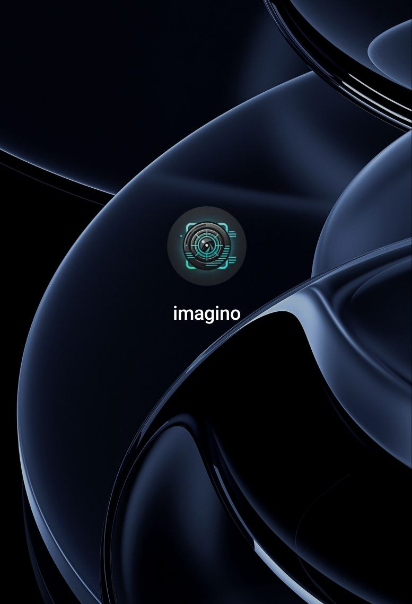
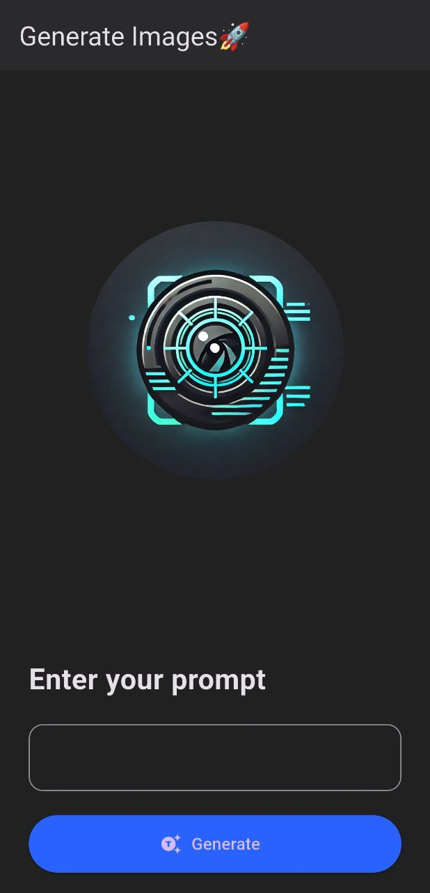
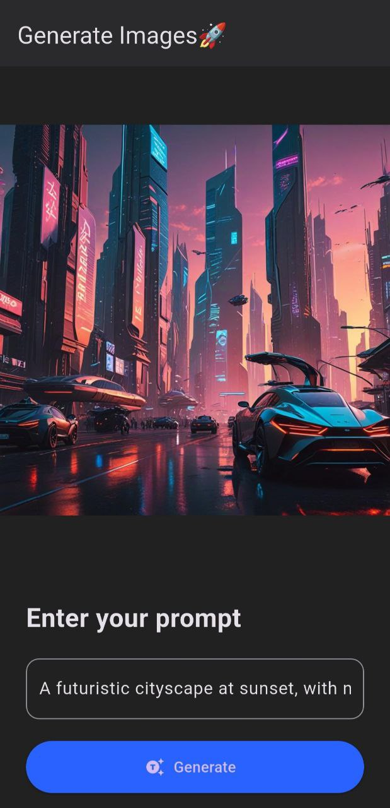

# 🎨 Imagino – AI Image Generator App using Flutter

## 🚀 Overview
**Imagino** is a Flutter-powered AI image generator app that transforms text prompts into stunning images. Built with clean architecture using Flutter Bloc, it connects with a backend image generation API and displays the results in real time with a smooth and intuitive user experience.

## 🌟 Features
- **Prompt-Based Generation** – Users can enter creative prompts to generate images instantly.
- **Real-Time Image Preview** – Instantly view generated images in the app.
- **Cross-Platform Support** – Compatible with both Android and iOS.
- **Smooth UI** – Clean, modern design for an engaging user experience.
- **State Management** – Efficiently managed with `flutter_bloc` for reactive updates.

## 🛠️ Tech Stack
- **Flutter** – UI toolkit for building natively compiled applications
- **Dart** – Programming language for Flutter development
- **Flutter Bloc** – For event-driven state management
- **API Integration** – Communicates with a backend to generate and fetch AI images

## 📸 Screenshots
_Add screenshots here (example):_





## 📚 Setup and Installation

### 🔄 Clone the Repository
```bash
git clone https://github.com/kundan-ksr/imagino-ai.git
cd imagino-ai
```
### 📦 Install Dependencies
Make sure you have Flutter installed. Then run:

   ```bash
   flutter pub get
   ```

### Set Up API Integration
   Update the API URL or settings in the code if necessary to fetch dynamic wallpapers.

### ⚙️ Run the App
To launch the app on an emulator or physical device:

   ```bash
   flutter run
   ```
## 📁 Project Structure

```
imagino-ai/
├── lib/                   # Source files, UI, and logic
├── assets/                # Images, UI assets, and placeholders
├── android/               # Android-specific platform code
├── ios/                   # iOS-specific platform code
├── macos/                 # macOS (if enabled)
├── linux/                 # Linux (if enabled)
├── windows/               # Windows (if enabled)
├── pubspec.yaml           # Flutter dependencies and assets
└── README.md              # Project documentation
```
## 🤝 Contributing
Contributions are welcome! If you have suggestions or want to enhance features, feel free to open an issue or submit a pull request.

## 🔐 License
This project is licensed under the MIT License. See the LICENSE file for more details.

## 🙌 Acknowledgments
Flutter for making cross-platform development seamless.
APIs for providing dynamic and high-quality images.

## 📧 Contact
#### Developed by Kundan Kumar
<ul>
<li>GitHub: https://github.com/kundan-ksr</li>
<li>Email: shivaayssr@gmail.com</li>
<li>LinkedIn: linkedin.com/in/kundan08/</li>
</ul>

Feel free to reach out for any questions or suggestions.